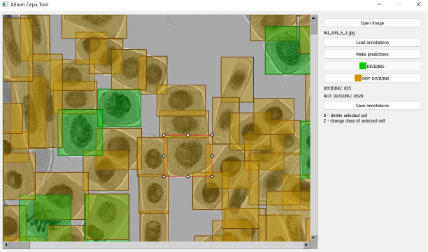

# Allium Cepa Tool

This application is used to annotate images of *Allium cepa* L. apical
meristem cells using a neural network.



## Installation

1. Clone the project:

    ```sh
    git clone https://gitlab.com/a-potemkin/allium-cepa-tool
    ```

2. Enter the directory and install the dependencies:

    ```sh
    cd allium-cepa-tool
    pip install -r requirements.txt
    ```

3. Run the program

    ```sh
    python app.py
    ```

## Usage

1. Click the **Open Image** button and wait for the loading to complete.
2. Get annotations:
    1. Click the **Make predictions** button and wait for the neural network
       to complete its work.
    2. Or Click the **Load annotations** button and wait for the loading
       to complete.
3. Edit the obtained annotations.
4. Click the **Save annotations** button to save the results to a JSON file.


## *Allium cepa* L. data set

You can download the dataset with labeled dividing and non-dividing cells for
the object detection task from [Google Drive](https://drive.google.com/file/d/1NP13zUKftwa6z-Hfhgd6XMz3KZbWJNgC/view?usp=sharing).
